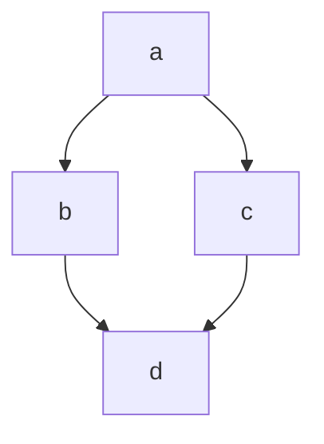

# Design

```mermaid
graph TD;
a-->b;
a-->c;
b-->d;
c-->d;

```

```mermaid
C4Context
 title System Context for Prøvetaking
 Person(inspektor, "Inspektør")
 
 Boundary(system, "Prøvetaking")
 {
   System(inspApp, "Inspektør App")
 }
 
 Rel(inspektor, inspApp, "Uses")

```
