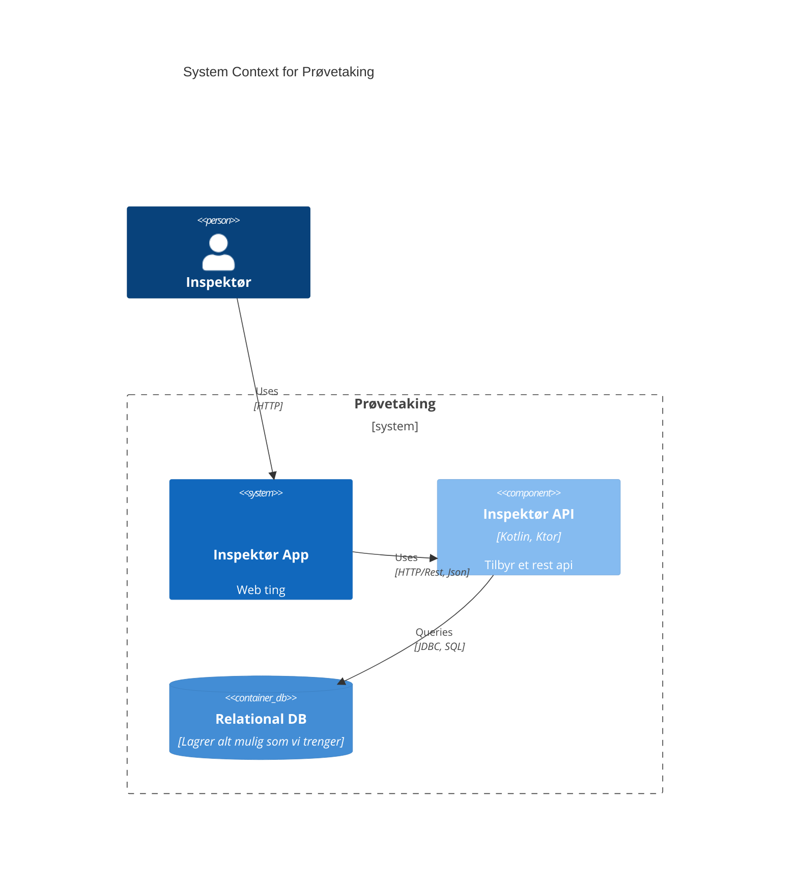

# Design

```mermaid
C4Context
 title System Context for Prøvetaking
 Person(inspektor, "Inspektør")
 
 Boundary(system, "Prøvetaking")
 {
   System(inspApp, "Inspektør App", "Web ting","Lar inspektøren gjøre det som trengs")
   Component(inspApi, "Inspektør API", "Kotlin, Ktor", "Tilbyr et rest api")
   ContainerDb(database, "Relational DB", "Lagrer alt mulig som vi trenger")
 }
 
 Rel(inspektor, inspApp, "Uses", "HTTP")
 Rel(inspApp,  inspApi, "Uses", "HTTP/Rest, Json")
 Rel(inspApi, database, "Queries", "JDBC, SQL")

```
